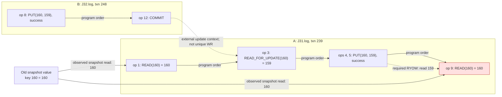

# Case 1: TiDB read-after-update candidates

From the SOSH2 repository root:

```bash
source artifacts/env.sh.example
artifacts/scripts/build-image.sh   # once; rebuild after Java changes
artifacts/scripts/case01/run.sh
```

The input is `tidb_20251203_202543` under
`artifacts/data/case-studies/case01-tidb-candidates/`.
The script checks this history with `B_PL299` (repeatable read),
using the ordinary binary parser. The result is UNSAT;
a `RejectException` is a normal rejection indicating an isolation violation.
Operation-level inspection of the RR history found the same-value-write/old-snapshot
pattern described below.

Bug report: [TiDB #64888](https://github.com/pingcap/tidb/issues/64888)
(TiDB 8.5.4, pessimistic RR).

## Why the RR history matches the reported bug pattern

Print the involved buggy transactions directly from the binary history:

```bash
artifacts/scripts/case01/show-bug-patterns.sh
```

The script prints to stdout; `*` marks the bug-pattern operations.

History:
`artifacts/data/case-studies/case01-tidb-candidates/tidb_20251203_202543/RANDOM_500txn_8op_2threads_D0_P30_R30_RMW30_RANGE10_ITER0_IsolationRR/`.

We decoded the serialized `J*.log` operations and found this witness on key `160`.
Transaction and operation indices below are **zero-based positions within the
session file**, not the checker's reassigned transaction IDs. Numeric keys/values
are decoded using the benchmark's sign-bit-flipped long encoding.

```text
A: J31.log, transaction 239
  op 00: BEGIN
* op 01: READ key=160 -> 160
  op 02: READ_FOR_UPDATE key=159 -> 159
* op 03: READ_FOR_UPDATE key=160 -> 159
* op 04: PUT key=160 value=159 success=true
* op 05: PUT key=160 value=159 success=true
  op 06: READ_FOR_UPDATE key=159 -> 159
  op 07: PUT key=159 value=159 success=true
  op 08: READ key=159 -> 160
* op 09: READ key=160 -> 160
  op 10: PUT key=160 value=160 success=true
  op 11: PUT key=159 value=160 success=true
  op 12: COMMIT

B: J32.log, transaction 248
  op 00: BEGIN
  op 01: READ key=159 -> nil
  op 02: PUT key=159 value=158 success=true
  op 03: PUT key=158 value=160 success=true
  op 04: PUT key=160 value=160 success=true
  op 05: READ key=159 -> 158
  op 06: PUT key=159 value=160 success=true
  op 07: PUT key=159 value=159 success=true
* op 08: PUT key=160 value=159 success=true
  op 09: RANGE key1=159 key2=168 val1=unset val2=unset forUpdate=true returned={159=159, 160=159}
  op 10: READ key=159 -> 159
  op 11: PUT key=159 value=159 success=true
* op 12: COMMIT
```



Solid program-order edges follow the recorded operations. The snapshot-read
edges show the old value 160. The dashed RYOW edge requires A's op 9 to read its
latest write, 159, but it returns 160.

This contains the report's essential conditions: another transaction commits the
new value, A observes that value through a current read, A successfully writes the
same value, and A's subsequent ordinary read returns its old snapshot value.

There are additional operations
on other keys, so the witness is embedded in a larger history rather than a minimal
two-transaction SQL reproduction. The full input has 503 serialized transactions.
