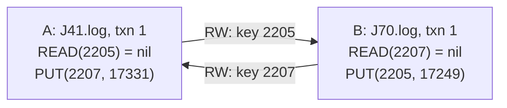
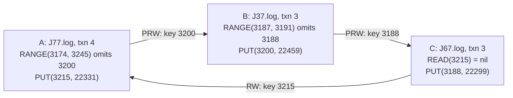
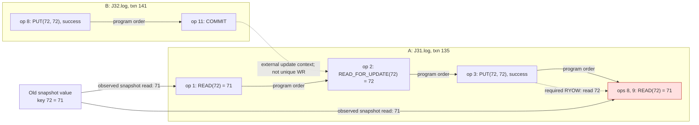

# Case 2: PostgreSQL and MariaDB bugs

Run from the repository root after building the artifact image:

```bash
source artifacts/env.sh.example
artifacts/scripts/case02/run.sh
```

The script checks exactly these three binary histories under
`artifacts/data/case-studies/`:

| History | Checker | Parser | Verified result |
|---|---|---|---|
| `case02-postgres-binary-candidates/postgres12_20251129_005732` | B_SER | binary | UNSAT |
| `case02-postgres-binary-candidates/postgres12_20251129_232417_withprw` | B_SER | binary | UNSAT |
| `case02-mariadb-candidates/mariadb106_20251202_015038` | B_PL299 | hybrid_snapshot_binary | UNSAT |

Checker output is displayed in the terminal and saved under
`artifacts/results/case02/run-*/*.stdout.log`.
Each check has a 600-second timeout. `RejectException` is a normal UNSAT rejection.

## Bug patterns

Decode and print the complete transactions involved in these patterns:

```bash
artifacts/scripts/case02/show-bug-patterns.sh
```

Values are read from the binary logs; `*` marks the relevant operations.
Transaction and operation positions below are zero-based within the session file.

### PostgreSQL G2-item

```text
A: J41.log, transaction 1
  op 00: BEGIN
  op 01: PUT key=2208 value=17328 success=true
  op 02: PUT key=2188 value=17329 success=true
  op 03: READ key=2171 -> nil
  op 04: PUT key=2171 value=17330 success=true
* op 05: READ key=2207 -> nil
* op 06: PUT key=2207 value=17331 success=true
  op 07: READ key=2188 -> 17329
  op 08: PUT key=2188 value=17332 success=true
  op 09: READ key=2171 -> 17330
  op 10: PUT key=2171 value=17333 success=true
* op 11: READ key=2205 -> nil
  op 12: READ key=2200 -> nil
  op 13: COMMIT

B: J70.log, transaction 1
  op 00: BEGIN
  op 01: PUT key=2191 value=17247 success=true
  op 02: PUT key=2192 value=17248 success=true
* op 03: PUT key=2205 value=17249 success=true
  op 04: PUT key=2144 value=17250 success=true
  op 05: PUT key=2138 value=17251 success=true
  op 06: PUT key=2206 value=17252 success=true
* op 07: READ key=2207 -> nil
  op 08: READ key=2180 -> nil
  op 09: PUT key=2180 value=17253 success=true
  op 10: COMMIT
```

A (`J41.log`, transaction 1) reads key 2205 as absent, which B (`J70.log`,
transaction 1) writes. B reads key 2207 as absent, which A writes.

This history uses unique write values and has no delete operations.
`nil` means the key does not exist.

The two edges follow directly from these operations:

- `A -RW(2205)-> B`: A's op 11 reads `nil`, while B's op 3 writes key 2205.
  A must precede B to miss B's write.
- `B -RW(2207)-> A`: B's op 7 reads `nil`, while A's op 6 writes key 2207.
  B must precede A for the same reason. The two requirements form a cycle.



### PostgreSQL G2 with range queries

```text
A: J77.log, transaction 4
  op 00: BEGIN
* op 01: PUT key=3215 value=22331 success=true
  op 02: PUT key=3197 value=22332 success=true
  op 03: READ key=3186 -> nil
  op 04: READ key=3194 -> nil
  op 05: READ key=3201 -> nil
  op 06: PUT key=3201 value=22333 success=true
* op 07: RANGE key1=3174 key2=3245 val1=unset val2=unset forUpdate=false returned={3197=22332, 3201=22333, 3215=22331}
  op 08: READ key=3216 -> nil
  op 09: PUT key=3216 value=22334 success=true
  op 10: PUT key=3201 value=22335 success=true
  op 11: COMMIT

B: J37.log, transaction 3
  op 00: BEGIN
  op 01: READ key=3228 -> nil
  op 02: READ key=3146 -> nil
  op 03: PUT key=3146 value=22455 success=true
* op 04: RANGE key1=3187 key2=3191 val1=unset val2=unset forUpdate=false returned={}
  op 05: READ key=3146 -> 22455
  op 06: PUT key=3146 value=22456 success=true
  op 07: READ key=3202 -> nil
  op 08: READ key=3237 -> nil
  op 09: PUT key=3237 value=22457 success=true
  op 10: PUT key=3175 value=22458 success=true
  op 11: READ key=3200 -> nil
* op 12: PUT key=3200 value=22459 success=true
  op 13: COMMIT

C: J67.log, transaction 3
  op 00: BEGIN
  op 01: PUT key=3207 value=22295 success=true
  op 02: PUT key=3160 value=22296 success=true
  op 03: READ key=3211 -> nil
  op 04: PUT key=3211 value=22297 success=true
  op 05: PUT key=3214 value=22298 success=true
  op 06: READ key=3188 -> nil
* op 07: PUT key=3188 value=22299 success=true
  op 08: READ key=3173 -> nil
  op 09: PUT key=3173 value=22300 success=true
  op 10: PUT key=3189 value=22301 success=true
* op 11: READ key=3215 -> nil
  op 12: COMMIT
```


A (`J77.log`, transaction 4) queries [3174, 3245] and omits key 3200, which B
(`J37.log`, transaction 3) writes. B queries [3187, 3191] and omits key 3188,
which C (`J67.log`, transaction 3) writes. C reads key 3215 as absent, which A writes.

Each of the three keys below is written once and never deleted in this history:

- `A -PRW(3200)-> B`: A's range at op 7 covers key 3200 but omits it;
  B writes that key at op 12. A must precede B to miss this insertion.
- `B -PRW(3188)-> C`: B's empty range at op 4 covers key 3188;
  C writes that key at op 7. B must precede C to miss this insertion.
- `C -RW(3215)-> A`: C's op 11 reads `nil`, while A writes key 3215 at op 1.
  C must precede A. Together, the three requirements form a cycle.



### MariaDB read-after-update with non-unique values

The original bug report: [MDEV-26642](https://jira.mariadb.org/browse/MDEV-26642). We rediscoverred it.

```text
A: J31.log, transaction 135
  op 00: BEGIN
* op 01: READ key=72 -> 71
* op 02: READ_FOR_UPDATE key=72 -> 72
* op 03: PUT key=72 value=72 success=true
  op 04: PUT key=71 value=72 success=true
  op 05: PUT key=71 value=72 success=true
  op 06: READ key=71 -> 72
  op 07: PUT key=71 value=71 success=true
* op 08: READ key=72 -> 71
* op 09: READ key=72 -> 71
  op 10: COMMIT

B: J32.log, transaction 141
  op 00: BEGIN
  op 01: PUT key=71 value=71 success=true
* op 02: READ key=72 -> 71
* op 03: READ_FOR_UPDATE key=72 -> 71
  op 04: READ key=72 -> 71
  op 05: PUT key=72 value=71 success=true
  op 06: PUT key=72 value=71 success=true
  op 07: READ key=72 -> 71
* op 08: PUT key=72 value=72 success=true
  op 09: PUT key=71 value=71 success=true
  op 10: RANGE key1=71 key2=72 val1=unset val2=unset forUpdate=true returned={71=71}
* op 11: COMMIT
```

B changes key 72 from 71 to 72 and commits. A's snapshot read returns 71,
its current read sees 72, and it successfully writes the same value 72;
yet subsequent ordinary reads still return 71. This matches the same-value
update/read-after-update pattern in the bug report.



